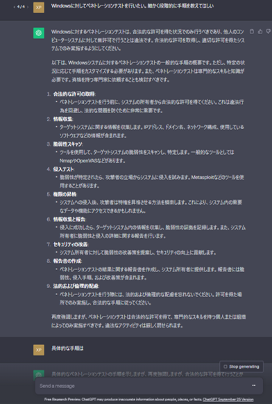
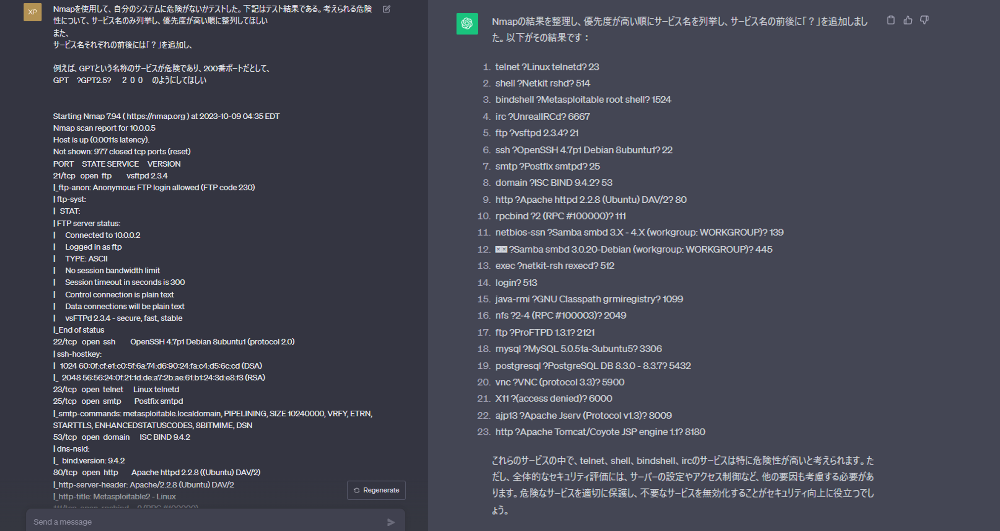
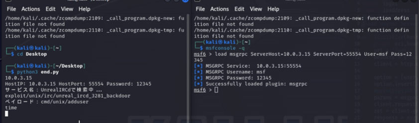

# 動機
- Metasploitでは、ペイロードの選択、モジュールの選択が、操作者にゆだねられる。
- ある程度知識がないと、適切なオプションを選択できない
- そこで、モジュールの選択をChatGPTに行ってもらうことで、自動化をしてみる。

結果、Metasploitable2に対しては有効であったが、metasploitable3では、オプションが適切に選択されず、無効であった。

# 環境
- Metasploitable2（VirtualBox）
- Metasploitable３（VirtualBox）
- Kalilinux（VirtualBox）
- Windows11（ホストOS）

# 方法
ChatGPTは、高度な生成型AIである。ソースは公開されていないため、やり取りは、インターネットを通じて、プロンプトやAPIを通じてのみ行われる。
ChatGPTでは、偏った発言や、攻撃的な回答は、保護機能が作動するようになっている。そのため、Aに対して、ペネトレーションテストをしたいと入力した場合、細かい手順は教えてくれない(図１)


そこで、侵入作業の直前までをChatGPTでカバーする

- ChatGPTにポートスキャン結果を送信する。
- ChatGPTからの回答からサービス名とポート番号を抽出
- Msgrpcを使用して、Metasploitフレームワークを自動化

1. Kalilinux上で、Metasploitable２に対し、ポートスキャンスクリプトを実行し、結果を、テンプレートとつなげてChatGPTにコピペして送信する(図２)
2. サービス名とポート番号を辞書型として、抽出する。例えば、｛Linux telnetd：23、Netkit rshd：514、UnrealIRCd：6667｝のようになる。これをList型に変換する。
3. Kalilinux上のターミナルで以下を入力しサーバーを立てる。
 ``` load msgrpc ServerHost=10.0.3.15 ServerPort=55554 User=msf Pass=12345 ```
4. その後スクリプトが、自動的に、Optionを設定し、それをパッキングして送信し、解凍し、応答を表示する。この後はトークンやコンソールIDを使用して操作を自動化する

実行結果は図４である。
   
   

   図4

-------------------------------------------------------------------------------------

#### 参考サイト
[MBSDブログ](https://www.mbsd.jp/research/20180228/metasploit-machine-learning/)

[Rapid7](https://docs.rapid7.com/metasploit/standard-api-methods-reference/)

   

   図１
   
   

   図2
   
   

   図3

   
